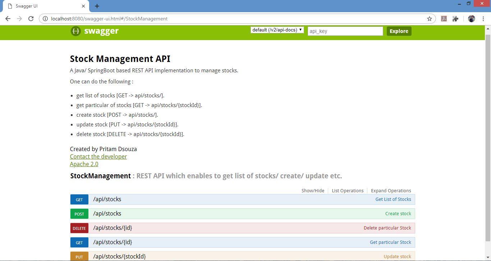

# Stock Management Rest API 

### Introduction
A Java/SpringBoot based REST API implementation to manage stocks. The stocks are initially loaded in H2 in memory database on application start up.

One can do the following :
* get list of stocks.
* get particular of stocks.
* create stock.
* update stock.
* delete stock.

### Stock API  
Currently application exposes 3 REST API's:
*   stockList : (url => /api/stocks , HTTP Methood = GET)
*   getStockById : (url => /api/stocks/{id} , HTTP Methood = GET)
*   createStock : (url => /api/stocks , HTTP Methood = POST)
*   updateStock : (url => /api/stocks/{id} , HTTP Methood = PUT)
*   deleteStock : (url => /api/stocks/{id} , HTTP Methood = DELETE)

The API details can be found on swagger-ui, which can be launched using the following url:  
- [http://localhost:8080/swagger-ui.html](http://localhost:8080/swagger-ui.html) --> launch after starting spring-boot application.

The swagger ui describing the API looks as following:


### Helpers
One can use any of the following methods to start the application

* Running as a packaged Application using the following command:
    ``` 
    $ java -jar target/stocks-management-service-0.0.1-SNAPSHOT.jar
    ```

* Running using maven plugin execute following command:
    ``` 
    $ mvn spring-boot:run
    ```
* Running using docker  
    - build container
      ``` 
      $ docker-compose -f docker-compose.yml build
      ```
    - boot container in detached mode
      ``` 
      $ docker-compose -f docker-compose.yml up -d
      ```


Postman collection can be [found](resources/postman/stocks-management-api.postman_collection.json).
This can be used to make direct API calls (emulating client).

### Future improvements 
- Server: Add more API's      
    - maintain life cycle of stocks 
    - filter list of stocks based on status (new / established/ blocked etc.)    
- Create client and server containers
- Add JWT authorization to access the api's    

## Author
* **Pritam Dsouza** - *Created the REST API to manage stocks in memory database* - dsouza.pritam@gmail.com